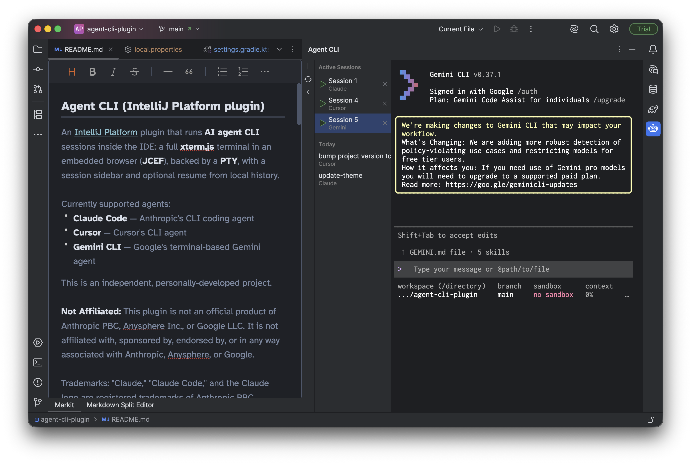
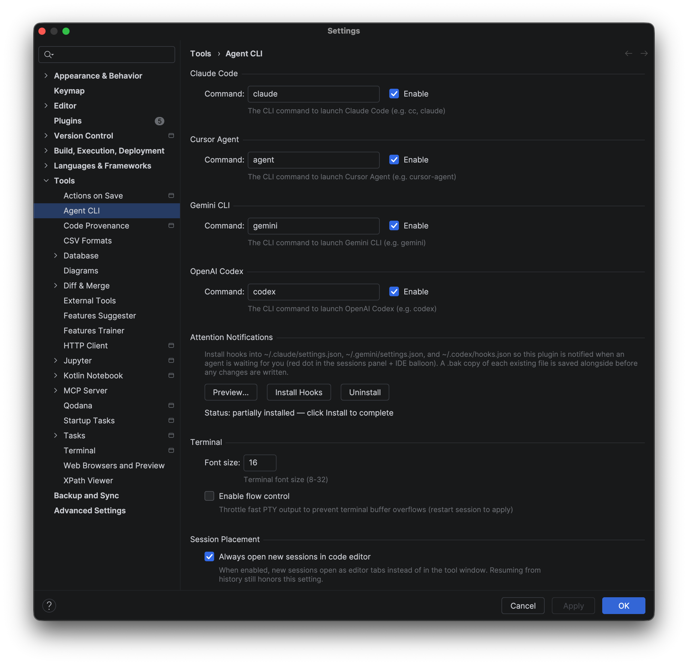

# Agent CLI (IntelliJ Platform plugin)

An [IntelliJ Platform](https://plugins.jetbrains.com/docs/intellij/welcome.html) plugin that runs **AI agent CLI** sessions inside the IDE: a full **xterm.js** terminal in an embedded browser (**JCEF**), backed by a **PTY**, with a session sidebar, resume from local history, attention notifications, and the option to host sessions in regular editor tabs.

Currently supported agents:

* **Claude Code** — Anthropic's CLI coding agent
* **Cursor** — Cursor's CLI agent
* **Gemini CLI** — Google's terminal-based Gemini agent
* **OpenAI Codex** — OpenAI's CLI coding agent

This is an independent, personally-developed project.

For a quick setup walkthrough, see [Getting Started](./GETTING_STARTED.md).

**Not Affiliated:** This plugin is not an official product of Anthropic PBC, Anysphere Inc., Google LLC, or OpenAI. It is not affiliated with, sponsored by, endorsed by, or in any way associated with any of them.

Trademarks: "Claude," "Claude Code," and the Claude logo are registered trademarks of Anthropic PBC. "Cursor" is a trademark of Anysphere Inc. "Gemini" and related marks are trademarks of Google LLC. "OpenAI" and "Codex" are trademarks of OpenAI. These terms are used here solely for descriptive purposes to indicate compatibility and help users find relevant tools.

No Warranty: This software is provided "as is," without warranty of any kind. Use of this plugin is at your own risk. You are responsible for complying with the respective terms of service and brand guidelines of any agent CLI you use.

## Screenshots



## Features

* **Tool window** — "Agent CLI" docked on the right of the IDE with an embedded terminal and a collapsible session sidebar.
* **Multi-agent support** — launch sessions for Claude Code, Cursor, Gemini CLI, or Codex from the same tool window (pick the agent from the **+** menu). Enable/disable each agent independently in settings.
* **Multiple sessions** — create, switch, close, and delete sessions from the sidebar. Sessions auto-close when the agent process exits. Middle-click or the close affordance closes; right-click offers **Close Session** and **Delete Session** (which also removes local history).
* **Session history** — browse past sessions for the current project, grouped by date (**Today**, **Yesterday**, **This Week**, **Older**), and resume by session id when not already open. History is read from each agent's local data:
    * Claude Code — `~/.claude/projects/…`
    * Cursor — `~/.cursor/projects/…/agent-transcripts/…`
    * Gemini CLI — `~/.gemini` (including `projects.json` and chat JSON under `tmp/<project>/chats`)
    * Codex — `~/.codex/sessions/…`
* **Open session in code editor** — right-click any active or historical session in the sidebar and pick **Open in Code Editor** to move the session into a regular editor tab. A **Return to plugin view** link at the top of the tab moves it back to the tool window. Each transition is a clean close + resume, so the sidebar's active-sessions list stays in sync regardless of where the session is displayed; closing the editor tab closes the session.
* **Attention notifications** — when an agent needs your input (permission prompt, idle confirmation, Codex permission request), the session row shows a red dot instead of the green play icon and an IDE balloon pops up (with an OS banner). Opt-in: install the hooks from **Settings → Tools → Agent CLI → Attention Notifications** and they merge idempotently into `~/.claude/settings.json`, `~/.gemini/settings.json`, and `~/.codex/hooks.json` with `.bak` backups; Uninstall cleanly removes them. Windows is supported via a bundled PowerShell script. Agents launched outside the IDE are a no-op — the hook skips the HTTP call entirely.
* **High-performance embedded terminal** — xterm.js-based with optional watermark flow control, clickable URL detection, UTF-8 encoding, and a 10,000-line scrollback buffer.
* **Theme sync** — terminal colors and scrollbars follow the IDE look-and-feel / editor colors and update dynamically when the theme changes.
* **Settings** — per-agent enable toggles and launch commands, terminal font size, and flow control toggle in **Settings → Tools → Agent CLI**.

## Requirements

* **IDE build** — compatible range is defined in `build.gradle.kts` (`sinceBuild` / `untilBuild`; currently **261–263.\***).
* **JCEF** — the embedded terminal needs a **JetBrains Runtime (JBR) with JCEF**. If JCEF is unavailable, the tool window shows a short fallback message instead of the terminal.
* **Agent CLI(s)** — install and authenticate the agent(s) you want to use:
    * [Claude Code](https://www.anthropic.com/claude-code) (default command: `claude`)
    * [Cursor](https://www.cursor.com/) (default command: `agent`)
    * [Gemini CLI](https://github.com/google-gemini/gemini-cli) (default command: `gemini`)
    * [OpenAI Codex CLI](https://github.com/openai/codex) (default command: `codex`)
* **JDK 17** — used to compile the plugin (see `build.gradle.kts`).

## Configuration



| Setting | Description |
| ------- | ----------- |
| **Enable Claude / Cursor / Gemini / Codex** | Toggles each agent on or off. Disabled agents are hidden from the **+** menu and history list. |
| **Claude command** | Command used to start Claude Code (default: `claude`). |
| **Cursor command** | Command used to start Cursor agent (default: `agent`). |
| **Gemini command** | Command used to start Gemini CLI (default: `gemini`). |
| **Codex command** | Command used to start Codex CLI (default: `codex`). |
| **Terminal font size** | Font size for the embedded xterm (allowed range as in the settings UI). |
| **Enable flow control** | Throttle PTY output behind an xterm.js write-ack watermark. Leave off unless fast-output agents cause terminal stuttering. |
| **Always open new sessions in code editor** | When enabled, new sessions open as regular editor tabs instead of in the tool window. You can still open individual sessions in the editor on demand via the sidebar's right-click menu regardless of this setting. |
| **Attention Notifications** | Install / uninstall per-agent hook scripts that notify the IDE when an agent needs attention. |

Persistent settings are stored in the application-level component configured in `plugin.xml`.

## Development

### Prerequisites

* JDK **17**
* Gradle (wrapper included: `./gradlew`)

### Common Gradle tasks

```bash
# Compile
./gradlew compileKotlin

# Build plugin distribution (ZIP under build/distributions/)
./gradlew buildPlugin

# Run a sandbox IDE with the plugin loaded
./gradlew runIde
```

Platform version is controlled via `gradle.properties` (`platformVersion`); the plugin targets IntelliJ IDEA by default via `build.gradle.kts`.

### Project layout (high level)

| Path | Role |
| ---- | ---- |
| `src/main/kotlin/.../toolwindow/` | Tool window factory, main panel, session sidebar |
| `src/main/kotlin/.../terminal/` | JCEF panel, PTY bridge, flow controller, HTML shell, theme JSON |
| `src/main/kotlin/.../session/` | Session manager, history readers (Claude / Cursor / Gemini / Codex), history deleter |
| `src/main/kotlin/.../editor/` | Virtual file + FileEditor for hosting sessions in editor tabs |
| `src/main/kotlin/.../notify/` | Attention HTTP endpoint, balloon service, hook installer |
| `src/main/kotlin/.../settings/` | Persistent settings and configurable UI |
| `src/main/resources/META-INF/plugin.xml` | Plugin descriptor |
| `src/main/resources/META-INF/pluginIcon.svg` | Plugin logo (Plugins list / Marketplace) |
| `src/main/resources/icons/` | Tool window icon |
| `src/main/resources/terminal/` | Bundled xterm.js and addons |
| `src/main/resources/notify/` | Per-agent notification hook scripts (installed by the hook installer) |

## Troubleshooting

* **No embedded terminal / JCEF message** — use an IDE distribution that ships **JCEF** (typically recent JetBrains IDEs on supported OS/architectures).
* **CLI not found or wrong shell** — ensure `PATH` in the IDE environment includes the agent CLI binary; adjust the relevant command in **Settings → Tools → Agent CLI**.
* **History empty** — history is resolved from the agent's project folder under your home directory; paths must match how the agent encodes the project.
* **Terminal output looks laggy on huge paste-ins** — try enabling **Flow control** in settings. Disabled by default
    because it adds a small round-trip per \~200 KB of output.
* **Attention balloon never fires** — re-install hooks from **Settings → Tools → Agent CLI → Attention Notifications** after upgrading the plugin or the agent CLI.

## Version

Plugin version is **`0.8.0`** (see `gradle.properties` and `plugin.xml`).

## License

This project is licensed under the Apache License 2.0. This license includes a specific "Limitation of Liability" and "Disclaimer of Warranty" to protect the contributors of this project. See the LICENSE file for full details.